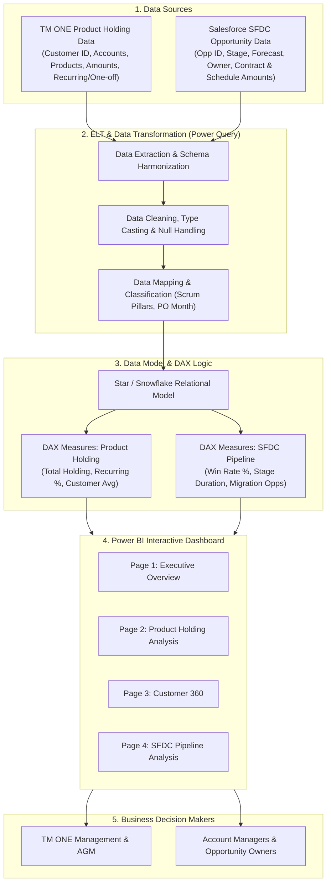

# TM ONE: Development of Power BI Dashboard for Product Holding & SFDC Opportunity Analysis

[](https://powerbi.microsoft.com/)
[](https://learn.microsoft.com/en-us/dax/)
[](https://learn.microsoft.com/en-us/power-query/)
[](https://www.salesforce.com/)
[](https://computing.utm.my/)
[](https://www.tmone.com.my/)

---

## 📌 Executive Summary

In modern enterprise telecommunications, data-driven decision-making is essential for monitoring revenue streams, tracking sales opportunities, and optimizing customer lifetime value. **TM ONE** manages extensive data assets comprising customer contract portfolios, subscribed product holdings, and **Salesforce (SFDC)** sales opportunities.

Historically, this data remained siloed across disconnected datasets and flat spreadsheets, requiring labor-intensive manual filtering, ad-hoc calculations, and disconnected reconciliation. 

This project delivers an enterprise-grade **Business Intelligence (BI) Dashboard** built with **Microsoft Power BI** using an **Extract, Load, Transform (ELT)** architecture. It integrates TM ONE Product Holding records with Salesforce CRM opportunity data to provide an interactive, single-pane-of-glass analytical solution featuring an **Executive Overview**, **Product Holding Analysis**, **Customer 360**, and **SFDC Pipeline Funnel Analysis**.

> **Academic Context**: Developed as a Final Year Project (FYP) for the award of Bachelor of Computer Science (Data Engineering), Faculty of Computing, **Universiti Teknologi Malaysia (UTM)** in collaboration with **TM ONE (Malaysia) Sdn. Bhd.**  
> **Author**: Vinesh A/L Vijayakumar

---


## 🎯 Problem Statement & Challenges

1. **Fragmented & Disparate Datasets**: Product holding details (`Append1`) and sales pipeline opportunities (`SFDC`) existed as distinct, unstructured flat files.
2. **Absence of a Customer 360 Perspective**: Stakeholders could not cross-reference what products a customer currently held against what new deals were actively being pursued in the SFDC pipeline.
3. **Inefficient Manual Reporting**: Analysts performed repetitive manual calculations in Excel (recurring vs. one-off revenue splits, conversion percentages, stage cycle durations), introducing latency and human error.
4. **Lack of Interactive Slice & Drill Exploration**: Business stakeholders lacked the capability to slice holding and pipeline metrics dynamically across customer groups, product pillars, sales owners, and fiscal periods.

---

## 🏆 Project Aim & Objectives

### Project Aim
To design, implement, and validate an interactive Business Intelligence dashboard for TM ONE Product Holding and SFDC Opportunity Analysis using the Extract, Load, and Transform (ELT) approach in Microsoft Power BI.

### Core Objectives
1. **Analyze Requirements**: Investigate TM ONE product holding business metrics and SFDC opportunity data requirements to establish analytical dimensions and metrics.
2. **Model Data Architecture**: Design a normalized and performant data model (Star/Snowflake schema) and UI/UX wireframes enabling multidimensional filtering.
3. **Develop End-to-End ELT & Dashboard**: Implement data ingestion via Power Query, business logic using advanced DAX calculations, and interactive visualizations with synchronized slicing and navigation.
4. **Comprehensive System Validation**: Verify computational correctness, filter synchronization, and user acceptance through Black Box, White Box, and User Acceptance Testing (UAT).

---

## 🏗️ System Architecture & Data Engineering Pipeline




## 📊 Dashboard Modules & Key Visualizations

The Power BI system consists of four dedicated reporting interfaces:

### 1. Executive Overview
- **Objective**: High-level corporate view of performance across both business arms.
- **Components**:
  - High-impact KPI cards: Total Revenue Value (TRV), Total Active Customers, Total Active Products, Total Pipeline Opportunities, Total Contract Value, and Scheduled Revenue.
  - Cross-cutting charts: Revenue by Product, Revenue Trend, Revenue by Customer, Customer × Product Revenue Matrix, and Recurring vs. One-off split.
  - Global slicers: Vertical and Segment filters.

### 2. Product Holding Analysis
- **Objective**: Deep-dive analytics on customer portfolios and product penetration.
- **Components**:
  - Metrics: Total Holding Amount, Total Customers, Total Products, Total Billing Accounts, and Average Holding Amount per Customer.
  - Visuals: Holding Amount by Product Grouping, Holding Amount by Product Category, Top 10 Customers by Revenue, Holding Amount by Scrum Pillar, Recurring vs. One-Off distribution.
  - Granular Matrix/Table: Itemized billing records by account, customer group, and product code.
  - Slicers: Year, Month, Product Grouping, Customer Group, Product Category.

### 3. Customer 360
- **Objective**: Unified view of individual customer accounts connecting current contracts with future opportunities.
- **Components**:
  - Customer KPI banner: Selected Customer Holding Amount, Distinct Products Held, Account Count, Open Opportunities, Total Contract Value, Total Scheduled Delivery.
  - Dual-pane layout:
    - **Current Holding Section**: Customer product holding matrix, subscribed plans, and product category distribution.
    - **Salesforce Pipeline Section**: In-flight SFDC deals, stage status, opportunity owner, and projected contract amounts.
  - Slicers: Customer Group and Customer Name selector.

### 4. SFDC Pipeline Analysis
- **Objective**: Sales funnel transparency, deal conversion tracking, and cycle velocity.
- **Components**:
  - Funnel KPIs: Total Opportunities, Total Contract Amount, Total Schedule Amount, Closed Won %, Average Stage Duration (Days), and Migration Opportunity volume.
  - Analytics: Contract Amount by Opportunity Stage, Opportunity Count by Forecast Category, Contract Amount by Product Family, Opportunity Trend by Purchase Order (PO) Month.
  - Slicers: Stage, Forecast Category, Opportunity Owner, Assistant General Manager (AGM), PO Month.

---

## 📐 UML Diagrams & System Engineering Specs

Standardized UML behavioral and structural diagrams are maintained in [`screenshots/`](screenshots/):

| Use Case ID | Use Case Name | Activity Diagram | Sequence Diagram |
| :--- | :--- | :--- | :--- |
| **UC01** | View Executive Overview | [`activity_diagram_uc01...`](screenshots/activity_diagram_uc01_view_executive_overview.png) | [`sequence_diagram_uc01...`](screenshots/sequence_diagram_uc01_view_executive_overview.png) |
| **UC02** | Analyze Product Holding | [`activity_diagram_uc02...`](screenshots/activity_diagram_uc02_analyze_product_holding.png) | [`sequence_diagram_uc02...`](screenshots/sequence_diagram_uc02_analyze_product_holding.png) |
| **UC03** | View Customer 360 | [`activity_diagram_uc03...`](screenshots/activity_diagram_uc03_view_customer_360.png) | [`sequence_diagram_uc03...`](screenshots/sequence_diagram_uc03_view_customer_360.png) |
| **UC04** | Analyze SFDC Pipeline | [`activity_diagram_uc04...`](screenshots/activity_diagram_uc04_analyze_sfdc_pipeline.png) | [`sequence_diagram_uc04...`](screenshots/sequence_diagram_uc04_analyze_sfdc_pipeline.png) |
| **UC05** | Apply Slicers & Filters | [`activity_diagram_uc05...`](screenshots/activity_diagram_uc05_apply_slicers_and_filters.png) | [`sequence_diagram_uc05...`](screenshots/sequence_diagram_uc05_apply_slicers_and_filters.png) |
| **UC06** | Navigate Between Pages | [`activity_diagram_uc06...`](screenshots/activity_diagram_uc06_navigate_between_pages.png) | [`sequence_diagram_uc06...`](screenshots/sequence_diagram_uc06_navigate_between_pages.png) |

- **System Architecture**: [`system_architecture_diagram.png`](screenshots/system_architecture_diagram.png)
- **Data Model (ERD)**: [`erd_diagram.png`](screenshots/erd_diagram.png)
- **Use Case Overview**: [`use_case_diagram.png`](screenshots/use_case_diagram.png)
- **UI Wireframe Blueprints**: [`interface_design_wireframes.png`](screenshots/interface_design_wireframes.png)

---

## 🧮 DAX Measure Catalog

All business calculations are version-controlled in the [`dax-measures/`](dax-measures/) directory.

### 1. Product Holding DAX Measures ([`product_holding_measures.dax`](dax-measures/product_holding_measures.dax))

```dax
-- Total revenue value held by customers
Total Holding Amount = 
SUM ( Append1[AMOUNT] )

-- Total volume of product holding records
Total Product Holding Records = 
COUNTROWS ( Append1 )

-- Count of distinct customers
Total Customers = 
DISTINCTCOUNT ( Append1[CUSTOMER_ID] )

-- Count of distinct customer accounts
Total Accounts = 
DISTINCTCOUNT ( Append1[ACCOUNT_NO] )

-- Count of distinct products
Distinct Product Codes = 
DISTINCTCOUNT ( Append1[PRODUCT_CODE] )

-- Revenue from recurring contracts only
Recurring Holding Amount = 
CALCULATE (
    [Total Holding Amount],
    Append1[One-Off Recurring] = "Recurring"
)

-- Proportion of recurring revenue vs total holding
Recurring Holding % = 
DIVIDE ( [Recurring Holding Amount], [Total Holding Amount] )

-- Average revenue per customer
Average Holding Amount per Customer = 
DIVIDE ( [Total Holding Amount], [Total Customers] )
```

### 2. SFDC Pipeline DAX Measures ([`sfdc_pipeline_measures.dax`](dax-measures/sfdc_pipeline_measures.dax))

```dax
-- Count of distinct sales opportunities
Total Opportunities = 
DISTINCTCOUNT ( SFDC[Opportunity ID] )

-- Total value of all opportunity contracts
Total Contract Amount = 
SUM ( SFDC[Contract Amount (Excluding SST)] )

-- Total scheduled delivery/billing value
Total Schedule Amount = 
SUM ( SFDC[Sum of Schedule Amount] )

-- Average cycle time an opportunity stays in a stage
Average Stage Duration = 
AVERAGE ( SFDC[Stage Duration] )

-- Count of won/closed deals
Closed Opportunities = 
CALCULATE (
    [Total Opportunities],
    SFDC[Stage] IN { "Closed", "Closed Won" }
)

-- Win / conversion rate
Closed Opportunity % = 
DIVIDE ( [Closed Opportunities], [Total Opportunities] )

-- Count of pipeline migration deals
Migration Opportunities = 
CALCULATE (
    [Total Opportunities],
    CONTAINSSTRING ( SFDC[Opportunity Name], "Migration" )
)

-- Value of pipeline migration deals
Migration Contract Amount = 
CALCULATE (
    [Total Contract Amount],
    CONTAINSSTRING ( SFDC[Opportunity Name], "Migration" )
)
```

---

## 🧪 System Testing & Quality Assurance

To ensure data integrity, UI responsiveness, and reliable reporting, testing was conducted across three distinct methodologies:

1. **Black Box Testing**:
   - Verified that interactive slicers (Year, Customer Group, Stage, Forecast Category) dynamically update all dependent KPI cards, matrices, and charts.
   - Tested cross-page navigation buttons and filter persistence across pages.
2. **White Box Testing**:
   - Validated DAX calculation paths, filter context transitions (`CALCULATE`, `DIVIDE` zero-division handling), and relationship cardinality in the data model.
3. **User Acceptance Testing (UAT)**:
   - Validated by business domain users and industry coaches at TM ONE to ensure metrics reflect real operational requirements and reporting standards.

---

## 🛠️ Technology Stack

- **Business Intelligence**: Microsoft Power BI Desktop & Power BI Service
- **Data Query & Transformation**: Microsoft Power Query (M Language)
- **Analytical Business Logic**: Data Analysis Expressions (DAX)
- **Source Systems**: Salesforce CRM (SFDC Opportunity Data) & TM ONE Product Holding Flat Files / Excel
- **Version Control & Documentation**: Git, GitHub, Markdown, Mermaid.js

---

## 👨‍💻 Project Information & Credits

- **Developer**: Vinesh A/L Vijayakumar (Matric No: A22EC0290)
- **Program**: Bachelor of Computer Science (Data Engineering)
- **Faculty**: Faculty of Computing, Universiti Teknologi Malaysia (UTM)
- **Industry Collaboration**: TM ONE (Malaysia) Sdn. Bhd.
- **Academic Session**: 2024 / 2025

